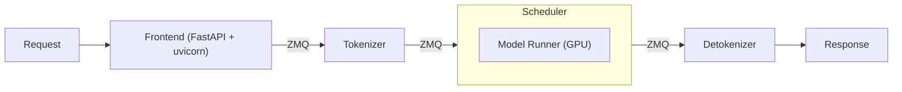
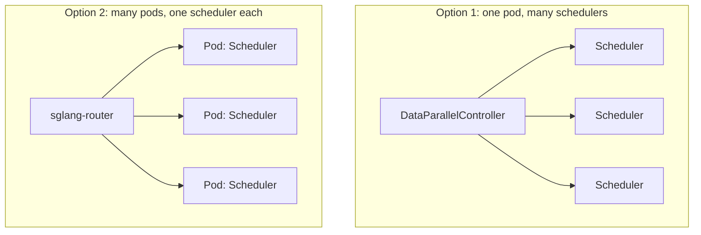

## LLM architecture

An LLM is an autoregressive model. Its backbone is a stack of blocks made of LayerNorm and Linear layers, with the attention module at the core. Around the backbone there is an input embedding layer and an output Linear layer.

The forward method takes the latest token plus the K, V of the previous tokens in the context. The flow of a forward pass is:

last token -> embedding -> compute current Q, K, V -> compute the distribution of the next token, then save K, V to the cache -> sampling -> next token

This shows that prefill and decode are not fundamentally different. Decode is just the special case where we only generate Q, K, V for the current token; prefill has to do it for every token in the prompt. With chunked prefill, we use a flag to indicate when sampling is not needed.

Previously prefill and decode could not run in the same batch, because the prefill graph varies with sequence length. In newer versions of SGLang/vLLM they can be batched together.

## Components of LLM serving

- **Frontend**: FastAPI endpoints served with uvicorn, handling incoming requests.
- Alongside it we spin up subprocesses: **Tokenizer**, **Scheduler**, and **Detokenizer**. The tokenizer receives a request from the frontend, tokenizes the message, and forwards it to the scheduler; the scheduler runs the model runner on the GPU and forwards the result to the detokenizer.
- These processes are connected by **ZMQ** queues. ZMQ is lightweight and broker-less, and these processes run in the same pod, so heavier options like Kafka or RabbitMQ don't make sense here.

When `dp > 1`, a **DataParallelController** sits between the tokenizer and the schedulers. It collects requests from the tokenizer, keeps its own statistics, and distributes requests to the ZMQ queue of each scheduler. Note that in SGLang the radix tree lives inside each scheduler, so the controller cannot truly implement cache-aware routing; it can use statistics to pick a scheduler, but that's the limit.

In this article we assume the model is small enough to fit on a single GPU, so TP is out of scope. One model runner on the GPU corresponds to one scheduler on the CPU.

## The scheduler and memory management

The scheduler has one job: making sure the GPU has enough memory to serve the ongoing requests. GPU main memory stores two things:

- model weights
- the K, V cache

Say we have 256 requests. Contiguous memory assignment for the K-V cache leads to potential waste, so we use **paged attention**, which splits the K, V cache into pages of tokens. There is overhead in page management, but it outweighs the cost of wasted memory.

Inside the scheduler there is an internal queue of requests waiting to be prefilled. The scheduler estimates the memory each request needs to decide whether it can join the next forward batch. Note that this internal queue is not strictly FIFO. This is a simplified view of how the scheduler works.

Some parameters related to memory management:

- **Max concurrent requests**: how many requests each scheduler can handle internally at a time. The default is usually 256.
- **Max processing tokens**: how many tokens a batch can process across both prefill and decode. This is compute-bound.
- **Number of available pages**: this mostly decides whether we run prefill in this batch, since decode only generates one new K-V pair at a time.

The last two parameters decide what the next batch does: run prefill for new requests, keep working on the current decode, or retract one or more decode processes so the rest can continue.

## What happens when a request finishes?

We clean up in CPU space only and leave the K, V cache untouched, to enable **prefix caching**. There are two distinct concepts:

- **Eviction**: removing unused cache pages. This is considered when admitting a new prefill request into the current batch. The radix cache helps decide which page to evict.
- **Retraction**: this happens when there isn't even enough memory for the ongoing decode requests.

We don't clean up beforehand; we wait until there isn't enough space left, then run retraction or eviction.

## How to deploy it?

To deploy an LLM with several independent instances, we have two options:

- **One pod, many schedulers**: a single pod runs several schedulers behind a DataParallelController.
- **Many pods, one scheduler each**: several pods each run a single scheduler, placed behind a service or, better, the **sglang-router** acting as an LLM gateway.

The DataParallelController has a similar set of routing algorithms to sglang-router. The former can be slightly better since it has a better view of the requests, but overall the delta should be minimal.

Each approach has its own advantages, but I prefer several pods each hosting a separate scheduler. It gives a clearer scaling pattern, and if something goes wrong in one pod it won't affect the others.