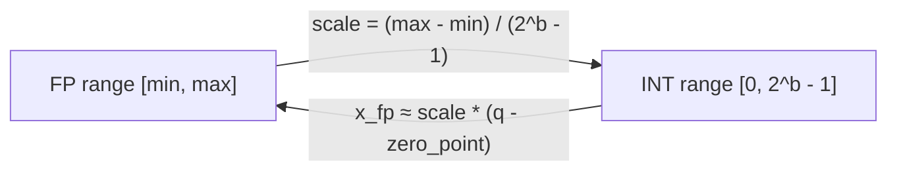
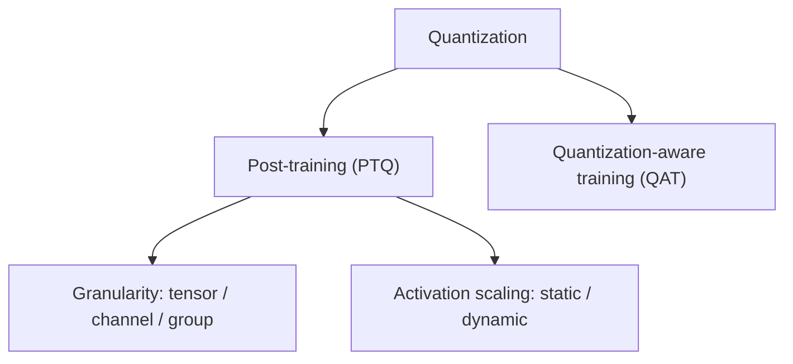
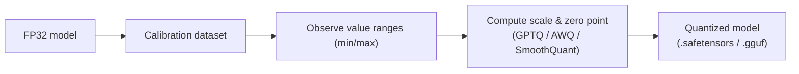

## Why we quantize LLM models

- **Reduce memory footprint**: the model is smaller, so we can host more models on the same hardware. It's not only the model size — quantization can also shrink activations and cached hidden states.

- **Accelerate inference**: the speedup comes from two places. The edge case is something like W8A8, where both weight and activation are INT8 and we have hardware that accelerates INT8 matmul. More generally, the speedup does **not** come from faster computation (when the matmul runs we often dequantize back to the original precision anyway) but from moving less data through the memory hierarchy. The model normally sits in HBM, the GPU's main memory; when a layer is used, its weights are moved to a smaller but faster memory (SRAM/registers) reserved for computation. The smaller the data, the faster this transfer. This matters because decode is memory-bound: less data transfer means better cache utilization and lower latency.

- **Reduce energy consumption** and enable deployment on resource-constrained devices.

## Which representation

Floating point (FP32, FP16) vs fixed point (INT8, INT4). Quantization maps a continuous floating-point range onto a small set of integers.



## Quantization scheme

**Symmetric vs asymmetric**: symmetric is the special case of asymmetric where the zero point is 0.

Two parameters define the mapping:

- **Scale**: the step size between adjacent quantized integer values.
- **Zero point**: the integer value that corresponds to the real number 0.

## Quantization granularity

Every quantization method needs the min and max value to compute the scale and zero point. This is problematic when there is an outlier that is too big or too small: taking it into account squeezes the rest of the values into a very small range, making them indistinguishable. One way to address this is to split the tensor into groups so each group has its own value range, making the blast radius smaller. There are three levels:

- **Tensor-wise**: take the whole tensor to determine the min/max.
    - Pros: quick, less overhead.
    - Cons: prone to the outlier problem.

- **Channel-wise**: compute the min/max per channel.
    - Pros: more accurate, since values in the same channel tend to share a range.
    - Cons: more overhead, since we store a scale and zero point per channel — but still manageable.

- **Group-wise**: compute the min/max over a contiguous array.
    - Pros: best result.
    - Cons: a lot of compute and storage overhead, but useful when pushing quantization to the extreme (INT4, INT2).

On the same topic, we can also do clipping to ignore outliers, but this potentially introduces more error into the quantization process.

## Measuring quantization error

1. **MSE** between the values before and after quantization. It's a rough estimate and doesn't really reflect real performance.
2. **Downstream task performance**, which is more reasonable but takes time to run.

Remember that we don't use this error to optimize anything — only to check whether the performance drop is acceptable.

## Types of quantization

1. **Post-training quantization (PTQ)**: the most popular. After training, we freeze the weights and quantize. It might require a small dataset, but only for calibration (determining the min/max range of weights and activations), not for training. It's quick and stable, especially for LLMs.
2. **Quantization-aware training (QAT)**: training the model with special operators that simulate quantization, so the model adapts to the conversion better. It's more complex and requires training data. For now it's out of scope.



## Post-training quantization

The workflow:

1. Obtain the pre-quantized model at full precision, normally FP32.
2. Obtain a representative dataset for calibration. It needs to reflect the data the model will serve in production.
3. Observe value ranges: run inference over the dataset and collect statistics (min/max range) of the weights and intermediate-layer activations.
4. Calculate the quantization params (scale and zero point). There are several algorithms for this step, like GPTQ, AWQ, or SmoothQuant.
5. Quantize the model: use the scale and zero point to convert it to the target precision. Store these params alongside the tensors so we can dequantize at inference time. Because of that, we don't use conventional formats like `.pth` (PyTorch), `.trt` (TensorRT), or `.tf` (TensorFlow); we use `.safetensors` or `.gguf`.



## Static vs dynamic quantization

These two terms describe **when the activation scales are computed**, not whether activations are quantized at all. Both quantize the weights ahead of time.

- **Static quantization**: activation scales are precomputed from calibration data and baked into the model before deployment. At inference time, both weights and activations run in low precision (e.g. INT8 matmul), and we dequantize the result afterward. This accelerates both compute-bound and memory-bound operations when the hardware supports it, but it's more complex and depends heavily on the calibration data being representative. SmoothQuant is a popular method that converts both weights and activations to INT8.

- **Dynamic quantization**: weights are quantized offline, but activation scales are computed **on the fly at runtime** for each input. There is no activation calibration step, which makes it simpler and more robust to distribution shift, at the cost of some runtime overhead to compute scales and (de)quantize activations per forward pass.

- **Weight-only quantization**: a separate idea — only the weights are quantized while activations stay in full precision. It mainly reduces model size and helps memory-bound operations; the weights are dequantized back to the original precision before each matmul, so the matmul itself runs in full precision. This is common for LLMs where decode is memory-bound.

| | Activation scale source | Matmul precision |
|---|---|---|
| Static | calibration (offline, fixed) | INT8 |
| Dynamic | computed per input at runtime | INT8 |
| Weight-only | activations not quantized | FP (weights dequantized first) |

### Computing the activation scale on the fly

When an activation tensor `X` reaches a quantized layer, dynamic quantization computes its range directly from the live values, right before the op. For symmetric INT8:

```
absmax = max(|X|)
scale  = absmax / 127          # 127 = 2^(8-1) - 1
q      = round(X / scale)      # the INT8 activation
```

It's the same min/max → scale formula as calibration, just run per forward pass instead of once ahead of time. For LLMs this is usually done **per-token** (one scale per row) so a single outlier token doesn't squeeze the range of the others. The overhead is exactly this extra reduction plus the quantize step on every pass — cheap relative to the matmul, but not free and harder to fuse.

### Scaling back after the matmul

With symmetric quantization (zero point 0), the scales factor cleanly out of the integer matmul. The matmul runs integer-only and accumulates into INT32:

```
Y_int = X_int @ W_int          # INT8 × INT8 → INT32
Y     = (scale_x · scale_w) · Y_int
```

So dequantization is a single multiply of the INT32 result by `scale_x · scale_w`, after which any bias is added in floating point. With per-token activation scales and per-channel weight scales, the scalars become vectors but still factor element-wise:

```
Y[i, j] ≈ scale_x[i] · scale_w[j] · Y_int[i, j]
```

This is just an outer product of the two scale vectors applied to the INT32 matrix — still a cheap pointwise op, which is why per-token + per-channel is the popular combo. Note this clean factoring only works because zero points are 0; **asymmetric** activations produce `(q - zp)` cross terms that must be computed and subtracted separately, which is a big reason activations are usually quantized symmetrically.

What to choose:

1. **Static** when you want:
    - the best latency, especially with hardware that supports low-precision matmul;
    - and you can invest time in the more complex pipeline and a high-quality, representative calibration set.

2. **Dynamic / weight-only** when you:
    - want a simpler approach and can afford the compute overhead of dequantizing during computation;
    - and your primary goal is reducing the model size.

Note that not every layer tolerates the same precision. Some layers are sensitive to quantization and you should consider skipping them entirely — the early embedding layer, normalization layers, or even the output layer.

## Limitations of basic PTQ

1. **Sensitivity to outliers**: can be mitigated, but not completely, by group quantization.
2. **Uniform quantization vs the non-uniform nature of weights**: quantization is uniform, meaning the step is constant. But weights and activations tend to concentrate around a peak (roughly a normal distribution), so uniform quantization loses precision because it doesn't match that distribution.
3. **Layer variance in sensitivity**: not every layer reacts the same way, so you should choose which layers to quantize for the best result.
4. **Aggressive low precision**: pushing to INT4/INT2 without sophisticated methods can hurt performance a lot, and not every task can tolerate such extreme quantization.
5. **Dependence on high-quality calibration data**: results are only as good as how representative the calibration set is.
